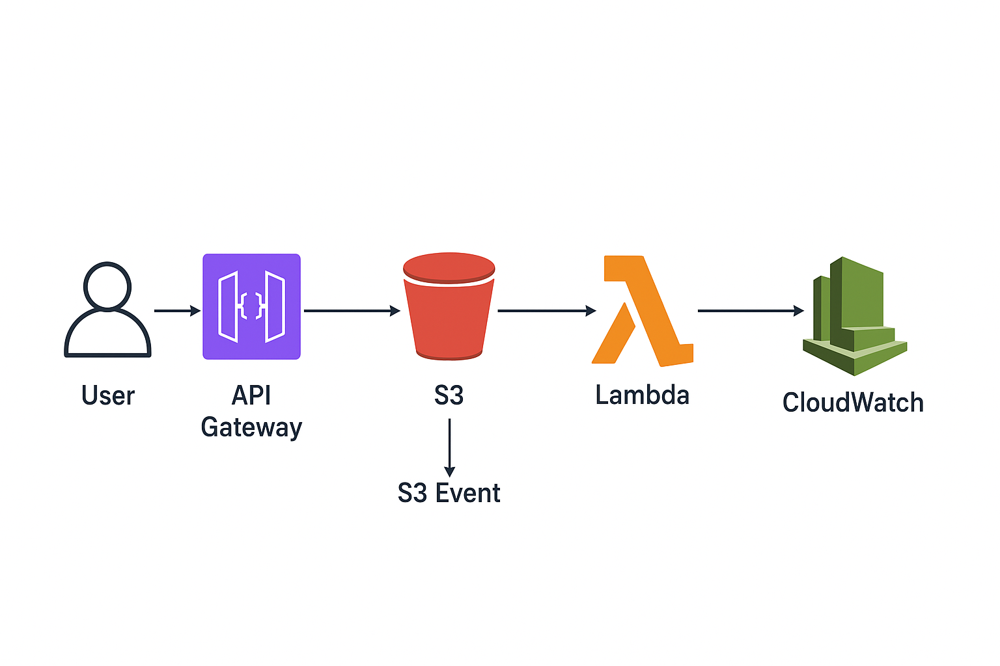

# Arquitetura Simplificada de Upload de Arquivos na AWS

Esta arquitetura mostra como um **arquivo** pode ser enviado, processado e armazenado na nuvem da AWS de forma **automática e segura**.

  

## Como funciona?

1. **Usuário**
   - Uma pessoa ou sistema envia um arquivo usando um link (endpoint).

2. **API Gateway**
   - É a "porta de entrada".  
   - Recebe a requisição do usuário e garante que apenas acessos autorizados passem.

3. **S3 (Armazenamento)**
   - O arquivo é guardado no **Amazon S3**, um serviço de armazenamento seguro e escalável.  
   - Pense nele como um "HD gigante na nuvem".

4. **S3 Event**
   - Quando um arquivo novo chega no S3, ele dispara um **evento automático**.

5. **Lambda (Função Automática)**
   - Uma função **Lambda** é executada quando o evento acontece.  
   - Essa função pode:
     - Ler informações do arquivo,
     - Processar dados,
     - Ou salvar resultados em outro lugar.

6. **CloudWatch (Monitoramento)**
   - Todos os passos podem ser monitorados pelo **CloudWatch**.  
   - Ele registra **logs** e gera **alertas** caso algo dê errado.

---

## Benefícios para o usuário

- **Automático**: depois do upload, tudo acontece sozinho.  
- **Seguro**: só quem tem permissão pode enviar arquivos.  
- **Escalável**: funciona mesmo que milhares de arquivos cheguem ao mesmo tempo.  
- **Baixo custo**: você só paga pelo que usa.  

---

✅ Resumindo:  
O usuário envia um arquivo → Ele vai para o **S3** → Dispara um **Lambda** para processar → Tudo é monitorado pelo **CloudWatch**.  

